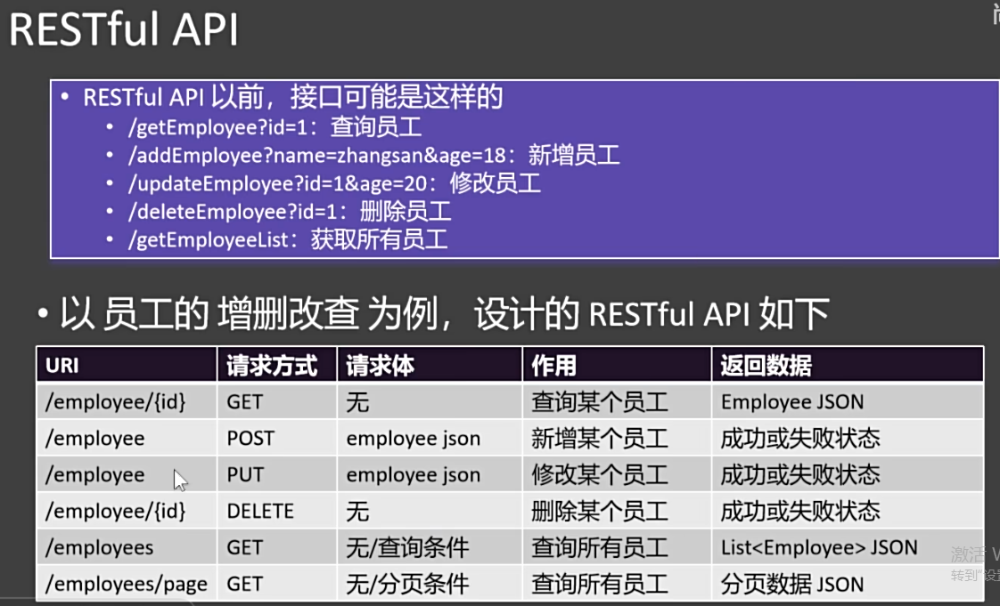
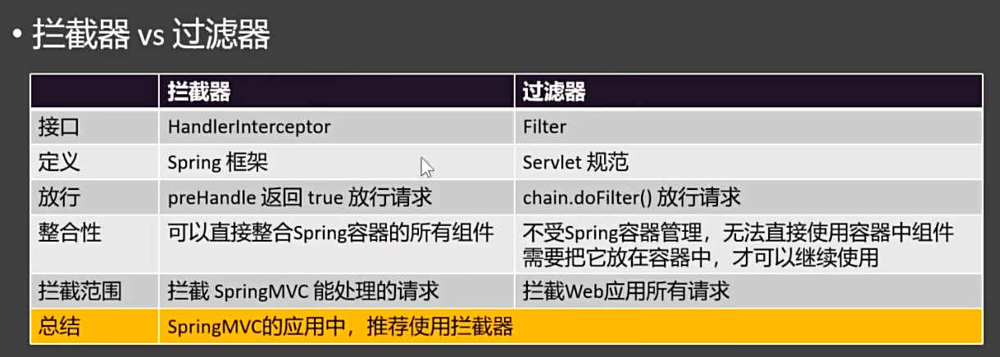
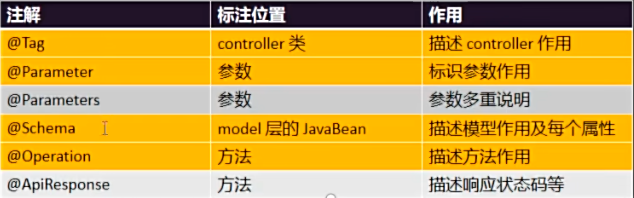
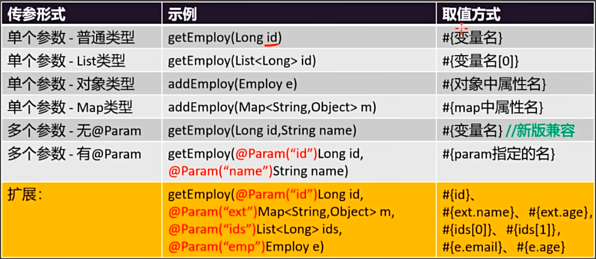
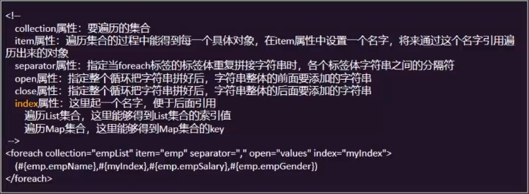
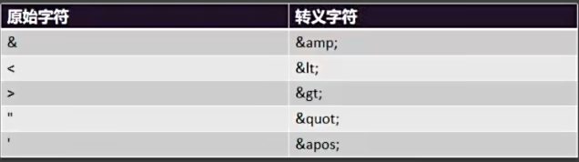
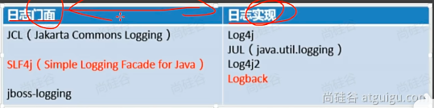
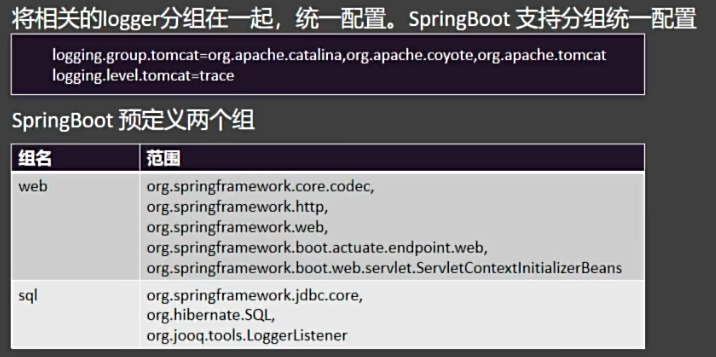
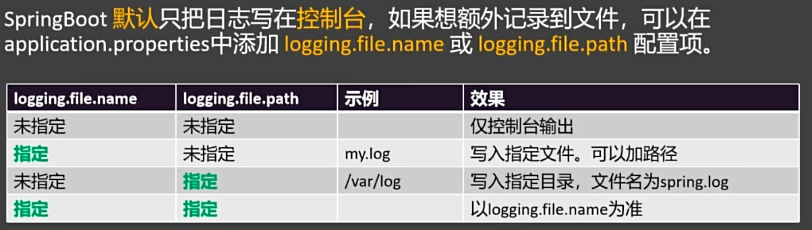
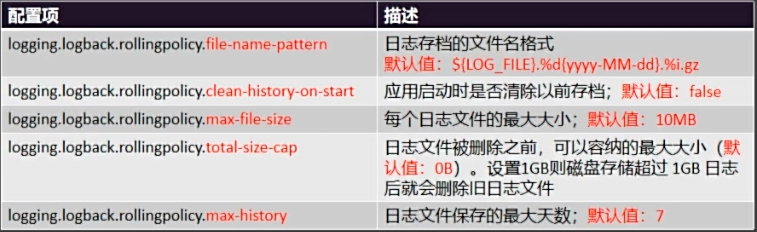

# 1.SpringMVC

## 1.1 SpringMVC - helloworld

```java
//@ResponseBody
//@Controller
//告诉Spring这是一个控制器（处理请求的组件）
@RestController //前后分离开发就用这个,是@ResponseBody+@Controller的合体
public class HelloController {

    //@ResponseBody  //把返回值放到响应体中； 每次请求进来执行目标方法，提到controller类上，就不需要每个方法单独标注了
    @RequestMapping("/hello")
    public String handle() {
        System.out.println("handle()方法执行了!");
        return "Hello,Spring MVC! 你好!~~~"; //默认认为返回值是跳到一个页面，由于前后端分离开发，需要返回数据，所以标注@ResponseBody返回数据
    }
}
```

## 1.2 @RequestMapping

### 1.2.1 路径映射

```java
@RestController
public class HelloController {
    /**
     *
     * 精确路径必须全局唯一
     * 路径位置通配符： 多个都能匹配上，那就精确优先
     *      *: 匹配任意多个字符（0~N）； 不能匹配多个路径
     *      **： 匹配任意多层路径
     *      ?: 匹配任意单个字符（1）
     *   精确程度： 完全匹配 > ? > * > **
     */
    @RequestMapping("/hello")
    public String handle() {
        System.out.println("handle()方法执行了!");
        return "Hello,Spring MVC! 你好!~~~"; //默认认为返回值是跳到一个页面
    }

    @RequestMapping("/he?ll")
    public String handle01() {
        System.out.println("handle01方法执行了!");
        return "handle01";
    }
    
    @RequestMapping("/he*ll")
    public String handle02() {
        System.out.println("handle02方法执行了!");
        return "handle02";
    }

    @RequestMapping("/he/**")
    public String handle03() {
        System.out.println("handle03方法执行了!");
        return "handle03";
    }

}
```

### 1.2.2 请求限定

```java
@RestController
public class RequestMappingLimitController {

    /**
     * 请求方式：
     *      GET, HEAD, POST, PUT, PATCH, DELETE, OPTIONS, TRACE
     *  Postman
     * @return
     */
    @RequestMapping(value = "/test01",method = {RequestMethod.DELETE,RequestMethod.GET})
    public String test01(){
        return "hello world";
    }

    /**
     * 请求参数：params = {"username","age"}
     * 1）、username：  表示请求必须包含username参数
     * 2）、age=18：   表示请求参数中必须包含age=18的参数
     * 3）、gender!=1：  表示请求参数中不能包含gender=1的参数
     * @return
     */
    @RequestMapping(value = "/test02",params = {"age=18","username","gender!=1"})
    public String test02(){
        return "test02";
    }

    /**
     * 请求头：headers = {"haha"}
     * 1）、haha：  表示请求中必须包含名为haha的请求头
     * 2）、hehe!=1：  表示请求头中 的 hehe 不能是1；（hehe=0，不带hehe）
     * @return
     */
    @RequestMapping(value = "/test03",headers = "haha")
    public String test03(){
        return "test03";
    }

    /**
     * 请求内容类型：consumes = {"application/json"}; 消费什么数据；
     * Media Type：媒体类型
     * 1）、application/json：  表示浏览器必须携带 json 格式的数据。
     * @return
     */
    @RequestMapping(value = "/test04",consumes = "application/json")
    public String test04(){
        return "test04";
    }

    /**
     * 响应内容类型：produces = {"text/plain;charset=utf-8"}; 生产什么数据；
     * @return
     */
    @RequestMapping(value = "/test05",produces = "text/html;charset=utf-8")
    public String test05(){
        return "<h1>你好，张三</h1>";
    }
}
```

## 1.3 @RequestParam

### 1.3.1 指定参数值

```java
@RestController
public class RequestTestController {

    /**
     * 请求参数：username=zhangsan&password=12345&cellphone=12345456&agreement=on
     * 要求：变量名和参数名保持一致
     * 1、没有携带：包装类型自动封装为null，基本类型封装为默认值
     * 2、携带：自动封装
     */
    @RequestMapping("/handle01")
    public String handle01(String username,
                           String password,
                           String cellphone,
                           boolean agreement){
        System.out.println(username);
        System.out.println(password);
        System.out.println(cellphone);
        System.out.println(agreement);
        return "ok";
    }

    /**
     * username=zhangsan&password=123456&cellphone=1234&agreement=on
     * @RequestParam: 取出某个参数的值，默认一定要携带。
     *      required = false：非必须携带；
     *      defaultValue = "123456"：默认值，参数可以不带。
     *
     * 无论请求参数带到了 请求体中还是 url? 后面，他们都是请求参数。都可以直接用@RequestParam或者同一个变量名获取到
     */
    @RequestMapping("/handle02")
    public String handle02(@RequestParam("username") String name,
                           @RequestParam(value = "password",defaultValue = "123456") String pwd,
                           @RequestParam("cellphone") String phone,
                           @RequestParam(value = "agreement",required = false) boolean ok){
        System.out.println(name);
        System.out.println(pwd);
        System.out.println(phone);
        System.out.println(ok);

        return "ok";
    }
}
```

### 1.3.2 POJO匹配封装

```java
@RestController
public class RequestTestController {

    /**
     * 如果目标方法参数是一个 pojo；SpringMVC 会自动把请求参数 和 pojo 属性进行匹配；
     * 效果：
     *      1、pojo的所有属性值都是来自于请求参数
     *      2、如果请求参数没带，封装为null；
     * @param person
     * @return
     */
    //请求体：username=zhangsan&password=111111&cellphone=222222&agreement=on
    @RequestMapping("/handle03")
    public String handle03(Person person){
        System.out.println(person);
        return "ok";
    }
}
```

## 1.4 @RequestHeader - 获取请求头

```java
@RestController
public class RequestTestController {

    /**
     * @RequestHeader：获取请求头信息
     */
    @RequestMapping("/handle04")
    public String handle04(@RequestHeader(value = "host",defaultValue = "127.0.0.1") String host,
                           @RequestHeader("user-agent") String ua){
        System.out.println(host);
        System.out.println(ua);
        return "ok~"+host;
    }
}
```

## 1.5 @CookieValue - 获取Cookie的值

```java
@RestController
public class RequestTestController {

    @RequestMapping("/handle05")
    public String handle05(@CookieValue("haha") String haha){
        return "ok：cookie是：" + haha;
    }
}
```

## 1.6 POJO级联封装

```java
@RestController
public class RequestTestController {

    /**
     * 使用pojo级联封装复杂属性
     * @param person
     * @return
     */
    @RequestMapping("/handle06")
    public String handle06(Person person){
        System.out.println(person);
        return "ok";
    }
}

/**
 * username=张三&password=111111&cellphone=122223334&agreement=on
 * &address.province=陕西&address.city=西安市&address.area=雁塔&
 * sex=男&hobby=足球&hobby=篮球&grade=二年级
 */
@Data //JavaBean 定死的数据模型； 定不死的写Map
public class Person {
    // username=zhangsan&password=123456&cellphone=1234&agreement=on
    private String username = "zhangsan"; // request.getParameter("username")
    private String password; // request.getParameter("password")
    private String cellphone;
    private boolean agreement;
    private Address address;
    private String sex;
    private String[] hobby; // request.getParameterValues("hobby")
    private String grade;
}


@Data
class Address {
    private String province;
    private String city;
    private String area;
}
```

## 1.7 @RequestBody

```java
@RestController
public class RequestTestController {

    /**
     * @RequestBody: 获取请求体json数据，自动转为person对象
     * 测试接受json数据
     * 1、发出：请求体中是json字符串，不是k=v
     * 2、接受：@RequestBody Person person
     *
     * @RequestBody Person person
     *      1、拿到请求体中的json字符串
     *      2、把json字符串转为person对象
     * @param person
     * @return
     */
    @RequestMapping("/handle07")
    public String handle07(@RequestBody Person person){
        System.out.println(person);
        //自己把字符串转为对象。
        return "ok";
    }
}

/**
 * username=张三&password=111111&cellphone=122223334&agreement=on
 * &address.province=陕西&address.city=西安市&address.area=雁塔&
 * sex=男&hobby=足球&hobby=篮球&grade=二年级
 */
@Data //JavaBean 定死的数据模型； 定不死的写Map
public class Person {
    // username=zhangsan&password=123456&cellphone=1234&agreement=on
    private String username = "zhangsan"; // request.getParameter("username")
    private String password; // request.getParameter("password")
    private String cellphone;
    private boolean agreement;
    private Address address;
    private String sex;
    private String[] hobby; // request.getParameterValues("hobby")
    private String grade;
}

@Data
class Address {
    private String province;
    private String city;
    private String area;
}
```

## 1.8 文件上传

```java
@RestController
public class RequestTestController {

    /**
     * 文件上传；
     * 1、@RequestParam 取出文件项，封装为MultipartFile，就可以拿到文件内容
     * @param person
     * @return
     */
    @RequestMapping("/handle08")
    public String handle08(Person person,
                           @RequestParam("headerImg") MultipartFile headerImgFile,
                           // @RequestParam("lifeImg") MultipartFile[] lifeImgFiles)
                           @RequestPart("lifeImg") MultipartFile[] lifeImgFiles) throws IOException {

        //1、获取原始文件名
        String originalFilename = headerImgFile.getOriginalFilename();
        //2、文件大小
        long size = headerImgFile.getSize();
        //3、获取文件流
        InputStream inputStream = headerImgFile.getInputStream();
        System.out.println(originalFilename + " ==> " + size);
        //4、文件保存
        headerImgFile.transferTo(new File("D:\\img\\" + originalFilename));
        System.out.println("===============以上处理了头像=================");
        if (lifeImgFiles.length > 0) {
            for (MultipartFile imgFile : lifeImgFiles) {
                imgFile.transferTo(new File("D:\\img\\" + imgFile.getOriginalFilename()));
            }
            System.out.println("=======生活照保存结束==========");
        }
        System.out.println(person);
        return "ok!!!";
    }
}
```

## 1.9 获取整个请求

```java
@RestController
public class RequestTestController {

    /**
     * HttpEntity：封装请求头、请求体； 把整个请求拿过来
     *    泛型：<String>：请求体类型； 可以自动转化
     *
     *
     * @return
     */
    @RequestMapping("/handle09")
    public String handle09(HttpEntity<Person> entity){

        //1、拿到所有请求头
        HttpHeaders headers = entity.getHeaders();
        System.out.println("请求头："+headers);
        //2、拿到请求体
        Person body = entity.getBody();
        System.out.println("请求体："+body);
        return "Ok~~~";
    }
}
```

## 1.10 传入原生API

@RestController
public class RequestTestController {

```java
/**
 * 接受原生 API
 * @param request
 * @param response
 */
@RequestMapping("/handle10")
public void handle10(HttpServletRequest request,
                       HttpServletResponse response,
                     HttpMethod method) throws IOException {
    System.out.println("请求方式："+method);
    String username = request.getParameter("username");
    System.out.println(username);
    response.getWriter().write("ok!!!"+username);
}
```
}

## 1.11 文件下载

```java
@RestController
public class ResponseTestController {


    /**
     * 会自动的把返回的对象转为json格式
     *
     * @return
     */
//    @ResponseBody //把返回的内容。写到响应体中
    @RequestMapping("/resp01")
    public Person resp01() {
        Person person = new Person();
        person.setUsername("张三");
        person.setPassword("1111");
        person.setCellphone("22222");
        person.setAgreement(false);
        person.setSex("男");
        person.setHobby(new String[]{"足球", "篮球"});
        person.setGrade("三年级");

        return person;
    }


    /**
     * 文件下载
     * HttpEntity：拿到整个请求数据
     * ResponseEntity：拿到整个响应数据（响应头、响应体、状态码）
     *
     * @return
     */
    @RequestMapping("/download")
    public ResponseEntity<InputStreamResource> download() throws IOException {

        //以上代码永远别改
        FileInputStream inputStream = new FileInputStream("C:\\Users\\53409\\Pictures\\Saved Pictures\\必应壁纸（1200张）\\AutumnNeuschwanstein_EN-AU10604288553_1920x1080.jpg");
        //一口气读会溢出
//        byte[] bytes = inputStream.readAllBytes();
        //1、文件名中文会乱码：解决：
        String encode = URLEncoder.encode("哈哈美女.jpg", "UTF-8");
        //以下代码永远别改
        //2、文件太大会oom（内存溢出）
        InputStreamResource resource = new InputStreamResource(inputStream);
        return ResponseEntity.ok()
                //内容类型：流
                .contentType(MediaType.APPLICATION_OCTET_STREAM)
                //内容大小
                .contentLength(inputStream.available())
                //  Content-Disposition ：内容处理方式
                .header("Content-Disposition", "attachment;filename="+encode)
                .body(resource);
    }
}
```

## 1.12 RESTful

* REST(Representational State Transfer 表现层状态转移 )是一种软件架构风格：
  * 官网：https://restfulapi.net/
  * 完整理解：Resource Representational State Transfer
    * Resource:资源
    * Representational:表现形势：比如用JSON,XML,JPEG等
    * State Transfer:状态变化：通过HTTP的动词（GET, POST, PUT, DELETE)实现
  * 一句话：使用资源名作为URI，使用HTTP的请求方式表示对资源的操作
* 满足REST风格的系统，我们成为RESTful系统



### 1.12.1 bean

```java
@Data
public class Employee {

    private Long id;
    private String name;
    private Integer age;
    private String email;
    private String gender;
    private String address;
    private BigDecimal salary;
}
```

### 1.12.2 common

```java
@Data
public class R<T> {
    private Integer code;
    private String msg;
    private T data;

    public static<T> R<T> ok(T data){
        R<T> tr = new R<>();
        tr.setCode(200);
        tr.setMsg("ok");
        tr.setData(data);
        return tr;
    }

    public static R ok(){
        R tr = new R<>();
        tr.setCode(200);
        tr.setMsg("ok");
        return tr;
    }

    public static R error(){
        R tr = new R<>();
        tr.setCode(500); //默认失败码
        tr.setMsg("error");
        return tr;
    }

    public static R error(Integer code,String msg){
        R tr = new R<>();
        tr.setCode(code); //默认失败码
        tr.setMsg(msg);
        return tr;
    }

    public static R error(Integer code,String msg,Object data){
        R tr = new R<>();
        tr.setCode(code); //默认失败码
        tr.setMsg(msg);
        tr.setData(data);
        return tr;
    }
}
```

### 1.12.3 controller

```java
/**
 * CORS policy：同源策略（限制ajax请求，图片，css，js）； 跨域问题
 * 跨源资源共享（CORS）（Cross-Origin Resource Sharing）
 *    浏览器为了安全，默认会遵循同源策略（请求要去的服务器和当前项目所在的服务器必须是同一个源[同一个服务器]），如果不是，请求就会被拦截
 *    复杂的跨域请求会发送2次：
 *    1、options 请求：预检请求。浏览器会先发送options请求，询问服务器是否允许当前域名进行跨域访问
 *    2、真正的请求：POST、DELETE、PUT等
 * 浏览器页面所在的：http://localhost   /employee/base
 * 页面上要发去的请求：http://localhost:8080   /api/v1/employees
 *  /以前的东西，必须完全一样，一个字母不一样都不行。浏览器才能把请求（ajax）发出去。
 *
 *  跨域问题：
 *    1、前端自己解决：
 *    2、后端解决：允许前端跨域即可
 *          原理：服务器给浏览器的响应头中添加字段：Access-Control-Allow-Origin = *
 */
@CrossOrigin  //允许跨域
@RequestMapping("/api/v1")
@RestController
public class EmployeeRestController {
    @Autowired
    EmployeeService employeeService;
    /**
     * code：业务的状态码，200是成功，剩下都是失败; 前后端将来会一起商定不同的业务状态码前端要显示不同效果。
     * msg：服务端返回给前端的提示消息
     * data： 服务器返回给前端的数据
     *   {
     *       "code": 300,
     *       "msg": "余额不足",
     *       "data": null
     *   }
     *
     *   前端统一处理:
     *      1、前端发送请求，接受服务器数据
     *      2、判断状态码，成功就显示数据，失败就显示提示消息（或者执行其他操作）。
     */

    /**
     * 按照id查询员工
     * @param id
     * @return
     *
     * /employee/1/2/3
     */
    @GetMapping("/employee/{id}")
    public R get(@PathVariable("id") Long id){
        Employee emp = employeeService.getEmp(id);
        return R.ok(emp);
    }

    /**
     * 新增员工；
     * 要求：前端发送请求把员工的json放在请求体中
     * @param employee
     * @return
     */
    @PostMapping("/employee")
    public R add(@RequestBody Employee employee){
        employeeService.saveEmp(employee);
        return R.ok();
    }

    /**
     * 修改员工
     * 要求：前端发送请求把员工的json放在请求体中； 必须携带id
     * @param employee
     * @return
     */
    @PutMapping("/employee")
    public R update(@RequestBody Employee employee){
        employeeService.updateEmp(employee);
        return R.ok();
    }

    /**
     *   @XxxMapping("/employee")：Rest 映射注解
     * @param id
     * @return
     */
    @DeleteMapping("/employee/{id}")
    public R delete(@PathVariable("id") Long id){
        employeeService.deleteEmp(id);
        return R.ok();
    }

    //语义化
    @GetMapping("/employees")
    public R all(){
       List<Employee> employees = employeeService.getList();
       return R.ok(employees);
    }
}
```

### 1.12.4 dao

* interface

```java
public interface EmployeeDao {


    /**
     * 根据id查询用户信息
     * @param id
     * @return
     */
    Employee getEmpById(Long id);

    /**
     * 新增员工
     * @param employee
     */
    void addEmp(Employee employee);

    /**
     * 修改员工
     * 注意：传入Employee全部的值，不改的传入原来值，如果不传代表改为null
     * @param employee
     */
    void updateEmp(Employee employee);

    /**
     * 按照id删除员工
     * @param id
     */
    void deleteById(Long id);

    /**
     * 查询所有
     * @return
     */
    List<Employee> getList();

}
```

* impl

```java
@Component
public class EmployeeDaoImpl implements EmployeeDao {


    @Autowired
    private JdbcTemplate jdbcTemplate;


    @Override
    public Employee getEmpById(Long id) {
        String sql = "select * from employee where id=?";
        Employee employee = jdbcTemplate.queryForObject(sql, new BeanPropertyRowMapper<>(Employee.class), id);
        return employee;
    }

    @Override
    public void addEmp(Employee employee) {
        String sql = "insert into employee(name,age,email,gender,address,salary) values (?,?,?,?,?,?)";
        int update = jdbcTemplate.update(sql,
                employee.getName(),
                employee.getAge(),
                employee.getEmail(),
                employee.getGender(),
                employee.getAddress(),
                employee.getSalary());
        System.out.println("新增成功，影响行数：" + update);
    }

    @Override
    public void updateEmp(Employee employee) {
        String sql = "update employee set name=?,age=?,email=?,gender=?,address=?,salary=? where id=?";
        int update = jdbcTemplate.update(sql,
                employee.getName(),
                employee.getAge(),
                employee.getEmail(),
                employee.getGender(),
                employee.getAddress(),
                employee.getSalary(),
                employee.getId());
        System.out.println("更新成功，影响行数：" + update);
    }

    @Override
    public void deleteById(Long id) {
        String sql = "delete from employee where id=?";
        int update = jdbcTemplate.update(sql, id);
    }

    @Override
    public List<Employee> getList() {

        String sql = "select * from employee";
        List<Employee> list = jdbcTemplate.query(sql, new BeanPropertyRowMapper<>(Employee.class));
        return list;
    }
}
```

### 1.12.5 service

* interface

```java
public interface EmployeeService {

    /**
     * 根据id查询用户
     * @param id
     * @return
     */
    Employee getEmp(Long id);

    /**
     * 更新用户
     * @param employee
     */
    void updateEmp(Employee employee);

    /**
     * 新增用户
     * @param employee
     */
    void saveEmp(Employee employee);


    /**
     * 根据id删除用户
     * @param id
     */
    void deleteEmp(Long id);

    /**
     * 查询所有用户
     * @return
     */
    List<Employee> getList();

}
```

* impl

```java
@Service // 要求：controller只能调service
public class EmployeeServiceImpl implements EmployeeService {

    @Autowired
    EmployeeDao employeeDao; //包装一下

    @Override
    public Employee getEmp(Long id) {
        Employee empById = employeeDao.getEmpById(id);
        return empById;
    }

    @Override
    public void updateEmp(Employee employee) {

        //防null处理。考虑到service是被controller调用的；
        //controller层传过来的employee 的某些属性可能为null，所以先处理一下
        //怎么处理？
        Long id = employee.getId();
        if(id == null){ //页面没有带id
            return;
        }
        //1、去数据库查询employee原来的值
        Employee empById = employeeDao.getEmpById(id);

        //=======以下用页面值覆盖默认值=============
        //2、把页面带来的覆盖原来的值，页面没带的自然保持原装
        if(StringUtils.hasText(employee.getName())){ //判断name有值（不是null、不是空串、不是空白字符// ）
            //把数据库的值改为页面传来的值
            empById.setName(employee.getName());
        }

        if(StringUtils.hasText(employee.getEmail())){
            empById.setEmail(employee.getEmail());
        }

        if (StringUtils.hasText(employee.getAddress())){
            empById.setAddress(employee.getAddress());
        }

        if (StringUtils.hasText(employee.getGender())){
            empById.setGender(employee.getGender());
        }

        if(employee.getAge() != null){
            empById.setAge(employee.getAge());
        }

        if(employee.getSalary() != null){
            empById.setSalary(employee.getSalary());
        }

        //以上判断，把页面提交的值，赋值给数据库的记录
        employeeDao.updateEmp(empById);

    }

    @Override
    public void saveEmp(Employee employee) {
        employeeDao.addEmp(employee);
    }

    @Override
    public void deleteEmp(Long id) {
        employeeDao.deleteById(id);
    }

    @Override
    public List<Employee> getList() {


        return employeeDao.getList();
    }
}
```

### 1.12.6 application.xml

```xml
spring.application.name=springmvc-restful-crud

spring.datasource.url=jdbc:mysql://localhost:3306/restful_crud
spring.datasource.username=root
spring.datasource.password=123456
spring.datasource.driver-class-name=com.mysql.cj.jdbc.Driver

robot.name=小哈哈
robot.model=gpt666
```

## 1.13 拦截器

* SpringMVC内置拦截器机制，允许在请求被目标方法处理的前后进行拦截，执行一些额外操作；比如：权限验证、日志记录、数据共享等。
* 使用步骤：
  * 实现HandlerInterceptor接口的组件即可成为拦截器
  * 创建WebMvcConfigurer组件，并配置拦截器的拦截路径
  * 查看执行顺序效果：preHandle->目标方法->postHandle->afterCompletion

### 1.13.1 使用拦截器步骤

* 实现HandlerInterceptor接口

```java
@Component //拦截器还需要配置（告诉SpringMVC，这个拦截器主要拦截什么请求）
public class MyHandlerInterceptor0 implements HandlerInterceptor {

    @Override
    public boolean preHandle(HttpServletRequest request,
                             HttpServletResponse response, Object handler) throws Exception {
        System.out.println("MyHandlerInterceptor0...preHandle...");
        //放行； chain.doFilter(request,response);
        //String username = request.getParameter("username");
//        response.getWriter().write("No Permission!");
        return true; // true：放行，false：拦截
    }

    @Override
    public void postHandle(HttpServletRequest request, HttpServletResponse response, Object handler, ModelAndView modelAndView) throws Exception {
        System.out.println("MyHandlerInterceptor0...postHandle...");
    }

    @Override
    public void afterCompletion(HttpServletRequest request, HttpServletResponse response, Object handler, Exception ex) throws Exception {
        System.out.println("MyHandlerInterceptor0...afterCompletion...");
    }
}
```

* 创建WebMvcConfigurer组件

```java
/**
 * 1、容器中需要有这样一个组件：【WebMvcConfigurer】
 *     1)、@Bean 放一个 WebMvcConfigurer
 *     2)、配置类实现 WebMvcConfigurer
 */
@Configuration //专门对SpringMVC 底层做一些配置
public class MySpringMVCConfig  implements WebMvcConfigurer{

    @Autowired
    MyHandlerInterceptor0 myHandlerInterceptor0;


    @Autowired
    MyHandlerInterceptor1 myHandlerInterceptor1;


    @Autowired
    MyHandlerInterceptor2 myHandlerInterceptor2;
    //添加拦截器
    @Override
    public void addInterceptors(InterceptorRegistry registry) {
        registry.addInterceptor(myHandlerInterceptor0)
                .addPathPatterns("/**"); //拦截所有请求
        registry.addInterceptor(myHandlerInterceptor1)
                .addPathPatterns("/**"); //拦截所有请求

        registry.addInterceptor(myHandlerInterceptor2)
                .addPathPatterns("/**");
    }


    //    @Bean
//    WebMvcConfigurer webMvcConfigurer(){
//        return new WebMvcConfigurer() {
//            @Override
//            public void addInterceptors(InterceptorRegistry registry) {
//
//            }
//        };
//    }
}
```

### 1.13.2 拦截器执行顺序

* 顺序preHandle->目标方法->倒序postHandle->渲染->倒序afterCompletion
  * 只有执行成功的preHandle会倒序执行afterCompletion
  * postHandle、afterCompletion从哪里炸，倒序链路从哪里结束
  * postHandle失败不会影响afterCompletion执行

### 1.13.3 拦截器和过滤器的区别



## 1.14 异常处理

* 编程式异常处理：
  * try - catch、throw、exception
* 声明式异常处理：
  * SpringMVC提供了 @ExceptionHandler、@ControllerAdivce 等便捷的声明式注解来进行快速的异常处理
  * @ExceptionHandler：可以处理指定类型异常
  * @ControllerAdvice：可以集中处理所有Controller的异常
  * @ExceptionHandler + @ControllerAdvice：可以完成全局统一异常处理

### 1.14.1 Controller级异常处理

此时仅该Controller出现异常才会被统一处理。如果发生异常，多个都能处理，就精确优先。

```java
/**
 * 测试声明式异常处理
 */
@RestController
public class HelloController {
    //编程式的异常处理；
    //如果大量业务都需要加异常处理代码的话，会很麻烦
//        try {
//            //执行业务
//
//        }catch (Exception e){
//            return R.error(100,"执行异常");
//        }
    @GetMapping("/hello")
    public R hello(@RequestParam(value = "i",defaultValue = "0") Integer i) throws FileNotFoundException {
        int j = 10 / i;

//        FileInputStream inputStream = new FileInputStream("D:\\123.txt");
        String s = null;
        s.length();
        return R.ok(j);
    }

    /**
     * 1、如果Controller本类出现异常，会自动在本类中找有没有@ExceptionHandler标注的方法，
     *    如果有，执行这个方法，它的返回值，就是客户端收到的结果
     *  如果发生异常，多个都能处理，就精确优先
     * @return
     */
    @ResponseBody
    @ExceptionHandler(ArithmeticException.class)
    public R handleArithmeticException(ArithmeticException ex){
        System.out.println("【本类】 - ArithmeticException 异常处理");
        return R.error(100,"执行异常：" + ex.getMessage());
    }

    @ExceptionHandler(FileNotFoundException.class)
    public R handleException(FileNotFoundException ex){
        System.out.println("【本类】 - FileNotFoundException 异常处理");
        return R.error(300,"文件未找到异常：" + ex.getMessage());
    }

    @ExceptionHandler(Throwable.class)
    public R handleException02(Throwable ex){
        System.out.println("【本类】 - Throwable 异常处理");
        return R.error(500,"其他异常：" + ex.getMessage());
    }
}
```

### 1.14.2 全局异常处理

* 全局异常配置

```java
// 全局异常处理器
//@ResponseBody
//@ControllerAdvice //告诉SpringMVC，这个组件是专门负责进行全局异常处理的
@RestControllerAdvice
public class GlobalExceptionHandler {

    /**
     * 如果出现了异常：本类和全局都不能处理，
     * SpringBoot底层对SpringMVC有兜底处理机制；自适应处理（浏览器响应页面、移动端会响应json）
     * 最佳实践：我们编写全局异常处理器，处理所有异常
     * <p>
     * 前端关心异常状态，后端正确业务流程。
     * 推荐：后端只编写正确的业务逻辑，如果出现业务问题，后端通过抛异常的方式提前中断业务逻辑。前端感知异常；
     * <p>
     * 异常处理：
     * 1、
     */
    @ExceptionHandler(ArithmeticException.class)
    public R error(ArithmeticException e) {
        System.out.println("【全局】 - ArithmeticException 处理");
        return R.error(500, e.getMessage()); //加@ResponseBody 配合 返回 对象，响应错误json
//        return "error"; //不加@ResponseBody 配合 返回String: 跳到错误页面
    }

    @ExceptionHandler(BizException.class)
    public R handleBizException(BizException e) {
        Integer code = e.getCode();
        String msg = e.getMsg();
        return R.error(code, msg);
    }

    @ExceptionHandler(value = MethodArgumentNotValidException.class)
    public R methodArgumentNotValidException(MethodArgumentNotValidException ex) {
        //1、result 中封装了所有错误信息
        BindingResult result = ex.getBindingResult();

        List<FieldError> errors = result.getFieldErrors();
        Map<String, String> map = new HashMap<>();
        for (FieldError error : errors) {
            String field = error.getField();
            String message = error.getDefaultMessage();
            map.put(field, message);
        }

        return R.error(500, "参数错误", map);
    }

    // 最终的兜底
    @ExceptionHandler(Throwable.class)
    public R error(Throwable e) {
        System.out.println("【全局】 - Exception处理" + e.getClass());
//        e.printStackTrace();
        return R.error(500, e.getMessage());
    }
}
```

* 统一返回格式

```java
@Schema(description = "统一返回")
@Data
public class R<T> {

    @Schema(description = "状态码")
    private Integer code;

    @Schema(description = "提示信息")
    private String msg;

    @Schema(description = "数据")
    private T data;

    public static<T> R<T> ok(T data){
        R<T> tr = new R<>();
        tr.setCode(200);
        tr.setMsg("ok");
        tr.setData(data);
        return tr;
    }

    public static R ok(){
        R tr = new R<>();
        tr.setCode(200);
        tr.setMsg("ok");
        return tr;
    }

    public static R error(){
        R tr = new R<>();
        tr.setCode(500); //默认失败码
        tr.setMsg("error");
        return tr;
    }

    public static R error(Integer code,String msg){
        R tr = new R<>();
        tr.setCode(code); //默认失败码
        tr.setMsg(msg);
        return tr;
    }

    public static R error(Integer code,String msg,Object data){
        R tr = new R<>();
        tr.setCode(code); //默认失败码
        tr.setMsg(msg);
        tr.setData(data);
        return tr;
    }
}
```

* 异常枚举

```java
public enum BizExceptionEnume {

    // ORDER_xxx：订单模块相关异常
    // PRODUCT_xxx：商品模块相关异常

    // 动态扩充.....
    ORDER_CLOSED(10001, "订单已关闭"),
    ORDER_NOT_EXIST(10002, "订单不存在"),
    ORDER_TIMEOUT(10003, "订单超时"),
    PRODUCT_STOCK_NOT_ENOUGH(20003, "库存不足"),
    PRODUCT_HAS_SOLD(20002, "商品已售完"),
    PRODUCT_HAS_CLOSED(20001, "商品已下架");

    @Getter
    private Integer code;
    @Getter
    private String msg;
    
    private BizExceptionEnume(Integer code, String msg) {
        this.code = code;
        this.msg = msg;
    }
}
```

* 业务异常

```java
/**
 * 业务异常
 * 大型系统出现以下异常：异常处理文档，固化
 * 1、订单  1xxxx
 *      10001 订单已关闭
 *      10002 订单不存在
 *      10003 订单超时
 *      .....
 * 2、商品  2xxxx
 *       20001 商品已下架
 *       20002 商品已售完
 *       20003 商品库存不足
 *       ......
 * 3、用户
 *      30001 用户已注册
 *      30002 用户已登录
 *      30003 用户已注销
 *      30004 用户已过期
 *
 * 4、支付
 *      40001 支付失败
 *      40002 余额不足
 *      40003 支付渠道异常
 *      40004 支付超时
 *
 * 5、物流
 *      50001 物流状态错误
 *      50002 新疆得加钱
 *      50003 物流异常
 *      50004 物流超时
 *
 * 异常处理的最终方式：
 * 1、必须有业务异常类：BizException
 * 2、必须有异常枚举类：BizExceptionEnume  列举项目中每个模块将会出现的所有异常情况
 * 3、编写业务代码的时候，只需要编写正确逻辑，如果出现预期的问题，需要以抛异常的方式中断逻辑并通知上层。
 * 4、全局异常处理器：GlobalExceptionHandler；  处理所有异常，返回给前端约定的json数据与错误码
 */

@Data
public class BizException extends RuntimeException {

    private Integer code; //业务异常码
    private String msg; //业务异常信息
    public BizException(Integer code, String message) {
        super(message);
        this.code = code;
        this.msg = message;
    }

    public BizException(BizExceptionEnume exceptionEnume) {
        super(exceptionEnume.getMsg());
        this.code = exceptionEnume.getCode();
        this.msg = exceptionEnume.getMsg();
    }
}
```

## 1.15 数据校验

* JSR 303 是Java为Bean数据合法性校验提供的标准框架，它已经包含在JavaEE 6.0标准中。JSR303通过在Bean属性上标注类似于@NotNull、@Max等标准的注解指定校验规则，并通过标准的验证接口对Bean进行验证。
* 数据校验使用流程
  1. 引入校验依赖：spring-boot-starter-validation
  2. 定义封装数据的Bean
  3. 给Bean的字段标注校验注解，并指定校验错误消息提示
  4. 使用@Valid、@Validated开启校验
  5. 使用BindingResult封装校验结果
  6. 使用自定义校验注解+校验器(implements ConstraintValidator)完成gender字段自定义校验规则
  7. 结合校验注解message属性与i18n文件，实现错误消息国际化
  8. 结合全局异常处理，统一处理数据校验错误

### 1.15.1 校验流程

* 引入校验依赖

```xml
		<dependency>
			<groupId>org.springframework.boot</groupId>
			<artifactId>spring-boot-starter-validation</artifactId>
		</dependency>
```

* Java Bean编写校验注解

```java
@Data
public class Employee {

    @NotBlank(message = "姓名不能为空")
    private String name;


    @NotNull(message = "年龄不能为空")
    @Max(value = 150, message = "年龄不能超过150岁")
    @Min(value = 0, message = "年龄不能小于0岁")
    private Integer age;


    @Email(message = "邮箱格式不正确")
    private String email;

    @Gender(message = "{gender.message}") //message = "{}" 占位符
    private String gender;
    private String address;
    private BigDecimal salary;


    //只要是日期：标注统一注解：@JsonFormat(pattern = "yyyy-MM-dd HH:mm:ss", timezone = "GMT+8")
    //默认的日期格式： 2024-09-05T08:47:58.000+00:00
    //反序列化：前端提交日期字符串 ===> 日期对象
    //序列化：  日期对象 ===> 日期字符串
    @JsonFormat(pattern = "yyyy-MM-dd HH:mm:ss", timezone = "GMT+8")
    private Date birth;
}
```

* 使用@Valid 告诉Spring MVC进行校验
* 在 @Valid 参数后面，紧跟一个 BindingResult 参数，封装校验结果【以后不用】

效果1： 如果校验不通过，目标方法不执

     新增员工；
     要求：前端发送请求把员工的json放在请求体中
     要求：如果校验出错，返回给前端。
       {
           "code": 500,
           "msg": "校验失败",
           "data": {
               "name": "姓名不能为空",  //这些就是为了让前端知道是哪些输入框错了，怎么错误，给用户要显示提示。
               "age": "年龄不能超过150"
           }
       }
```java
    @Operation(summary="新增员工")
    @PostMapping("/employee")
    public R add(@RequestBody @Valid EmployeeAddVo vo){

        if (!result.hasErrors()) {  //校验通过
			employeeService.saveEmp(employee);
			return R.ok();
        }
        // 说明校验错误； 拿到所有属性错误的信息
        Map<String, String> errorsMap = new HashMap<>();
        for (FieldError fieldError : result.getFieldErrors()) {
            //1、获取到属性名
            String field = fieldError.getField();
            //2、获取到错误信息
            String message = fieldError.getDefaultMessage();
            errorsMap.put(field, message);
        }
        return R.error(500, "校验失败", errorsMap);

    }
```

### 1.15.2 全局异常处理

全局异常捕获增加MethodArgumentNotValidException异常捕获：

```java
@ExceptionHandler(value = MethodArgumentNotValidException.class)
public R methodArgumentNotValidException(MethodArgumentNotValidException ex) {
    //1、result 中封装了所有错误信息
    BindingResult result = ex.getBindingResult();

    List<FieldError> errors = result.getFieldErrors();
    Map<String, String> map = new HashMap<>();
    for (FieldError error : errors) {
        String field = error.getField();
        String message = error.getDefaultMessage();
        map.put(field, message);
    }

    return R.error(500, "参数错误", map);
}
```


```java
    @Operation(summary="新增员工")
    @PostMapping("/employee")
    public R add(@RequestBody @Valid EmployeeAddVo vo){
        //把vo转为do；
        Employee employee = new Employee();
        //属性对拷
        BeanUtils.copyProperties(vo,employee);
        employeeService.saveEmp(employee);
        return R.ok();
   }
```

### 1.15.3 自定义校验器

* 自定义校验注解

```java
// 校验注解 绑定 校验器
@Documented
@Constraint(validatedBy = {GenderValidator.class})  //校验器去真正完成校验功能。
@Target({ FIELD })
@Retention(RUNTIME)
public @interface Gender {

    String message() default "{jakarta.validation.constraints.NotNull.message}";
    Class<?>[] groups() default { };
    Class<? extends Payload>[] payload() default { };

}
```

* 自定义校验器

```java
public class GenderValidator implements ConstraintValidator<Gender, String> {
    /**
     *
     * @param value 前端提交来的准备让我们进行校验的属性值
     * @param context 校验上下文
     *
     * @return
     */
    @Override
    public boolean isValid(String value, ConstraintValidatorContext context) {
        return "男".equals(value) || "女".equals(value);
    }
}
```

## 1.16 接口文档

* Knife4j使用，参考：https://doc.xiaominfo.com/docs/quick-start
* swagger标准常用注解；
* 访问http://ip:port/doc.html即可查看接口文档



# 2.MyBatis

## 2.1 获取自增id

```java
    <!--
        useGeneratedKeys： 使用自动生成的id
        keyProperty： 指定自动生成id对应的属性； 把自动生成的id封装到Emp对象的id属性中
        自增id回填
      -->
    <insert id="addEmp" useGeneratedKeys="true" keyProperty="id">
        insert into t_emp(emp_name, age, emp_salary) values (#{empName},#{age},#{empSalary})
    </insert>
```

## 2.2 开启驼峰命名

application.xml中配置该选项，便可以让表字段的下划线命名自动映射到Bean的驼峰字段名：

```xml
mybatis.configuration.map-underscore-to-camel-case=true
```

## 2.3 参数处理

### 2.3.1 单个参数

* #{}：底层使用PreparedStatement方式，SQL预编译后设置参数，无SQL注入攻击风险
* ${}：底层使用Statement方式，SQL无预编译，直接拼接参数，有SQL注入攻击风险
  * 所有参数位置，都应该用#{}
  * 需要动态表名等，才用${}
* 最佳实践：
  * 凡是使用了${}的业务，一定自己编写防SQL注入攻击代码



> 即使只有一个参数，也用@Param指定参数名。

## 2.4 返回值

### 2.4.1 返回集合类型

> 1.返回基本类型、普通对象都只需要resultType中声明返回值类型全类名即可
>
> 2.对象封装建议全局开启驼峰命名规则：mapUnderscoreToCamelCase = true
>
> * a_column会被映射为bean的aColumn属性
>
> 3.MyBatis为java.lang下的很多数据类型都起了别名，只需要Long, String, Double等这些表示即可，不用写全类名

* Mapper接口

```java
/**
 * 返回值结果：
 *   返回对象，普通：resultType="全类名"；
 *   返回集合：     resultType="集合中元素全类名"；
 * 最佳实践：
 *   1、开启驼峰命名
 *   2、1搞不定的，用自定义映射（ResultMap）
 */
@Mapper
public interface EmpReturnValueMapper {
    List<Emp> getAll();

    @MapKey("id") //定义返回Map的key为Emp的id字段值
        // 实际保存的不是 Emp，是 HashMap
    Map<Integer, Emp> getAllMap();
}
```

* mapper文件

```xml
    <!--   返回集合，写集合中元素类型 -->
    <select id="getAll" resultType="com.atguigu.mybatis.bean.Emp">
        select *
        from t_emp
    </select>

    <!-- 返回map集合，  resultType 写map中value元素类型 -->
    <select id="getAllMap" resultType="com.atguigu.mybatis.bean.Emp">
        select *
        from t_emp
    </select>
```

### 2.4.2 自定义结果集

* 数据库的字段如果喝Bean的属性不能一一对应，有两种方法
  1. 如果符合驼峰命名，则开启驼峰命名规则
  2. 编写自定义结果集（ResultMap）进行封装

```xml
    <!--
        默认封装规则（resultType）：JavaBean 中的属性名 去数据库表中 找对应列名的值。一一映射封装。
        自定义结果集（resultMap）：我们来告诉MyBatis 如何把结果封装到Bean中;
             明确指定每一列如何封装到指定的Bean中
      -->
    <resultMap id="EmpRM" type="com.atguigu.mybatis.bean.Emp">
        <!--id：声明主键映射规则-->
        <id column="id" property="id"></id>
        <!--result：声明普通列映射规则-->
        <result column="emp_name" property="empName"></result>
        <result column="age" property="age"></result>
        <result column="emp_salary" property="empSalary"></result>
    </resultMap>

    <!-- resultMap：指定自定义映射规则   -->
    <select id="getEmpById" resultMap="EmpRM">
        select *
        from t_emp
        where id = #{id}
    </select>
```

#### 2.4.2.1 一对一关联封装

* association标签：指定自定义对象封装规则，一般用户联合查询一对一关系的封装。比如一个用户对应一个订单
* javaType：指定关联的Bean的类型
* select：指定分步查询调用的方法
* column：指定分步查询传递的参数列

```xml
    <!--   自定义结果集 -->
    <resultMap id="OrderRM" type="com.atguigu.mybatis.bean.Order">
        <id column="id" property="id"></id>
        <result column="address" property="address"></result>
        <result column="amount" property="amount"></result>
        <result column="customer_id" property="customerId"></result>
        <!--      一对一关联封装  -->
        <association property="customer"
                     javaType="com.atguigu.mybatis.bean.Customer">
            <id column="c_id" property="id"></id>
            <result column="customer_name" property="customerName"></result>
            <result column="phone" property="phone"></result>
        </association>
    </resultMap>

    <select id="getOrderByIdWithCustomer"
            resultMap="OrderRM">
        select o.*,
               c.id c_id,
               c.customer_name,
               c.phone
        from t_order o
                 left join t_customer c on o.customer_id = c.id
        where o.id = #{id}
    </select>
```

* 分步查询

```xml
    <select id="getCustomerByIdAndOrdersStep" resultMap="CustomerOrdersStepRM">
        select *
        from t_customer
        where id = #{id}
    </select>

    <!--   分步查询：自定义结果集；封装订单的分步查询  -->
    <resultMap id="OrderCustomerStepRM" type="com.atguigu.mybatis.bean.Order">
        <id column="id" property="id"></id>
        <result column="address" property="address"></result>
        <result column="amount" property="amount"></result>
        <result column="customer_id" property="customerId"></result>
        <!--       customer属性关联一个对象，启动下一次查询，查询这个客户 -->
        <association property="customer"
                     select="com.atguigu.mybatis.mapper.OrderCustomerStepMapper.getCustomerById"
                     column="customer_id">
        </association>
    </resultMap>

    <select id="getOrderByIdAndCustomerStep" resultMap="OrderCustomerStepRM">
        select *
        from t_order
        where id = #{id}
    </select>
```

#### 2.4.2.2 一对多关联封装

* collection标签：自定自定义封装规则
* ofType：指定集合中的每个元素的类型
* select：指定分步查询调用的方法
* column：指定分步查询传递的参数列

```xml
    <resultMap id="CutomerRM" type="com.atguigu.mybatis.bean.Customer">
        <id column="c_id" property="id"></id>
        <result column="customer_name" property="customerName"></result>
        <result column="phone" property="phone"></result>
<!--
collection：说明 一对N 的封装规则
ofType: 集合中元素的类型
-->
        <collection property="orders" ofType="com.atguigu.mybatis.bean.Order">
            <id column="id" property="id"></id>
            <result column="address" property="address"></result>
            <result column="amount" property="amount"></result>
            <result column="c_id" property="customerId"></result>
        </collection>
    </resultMap>

    <select id="getCustomerByIdWithOrders" resultMap="CutomerRM">
        select c.id c_id,
               c.customer_name,
               c.phone,
               o.*
        from t_customer c
                 left join t_order o on c.id = o.customer_id
        where c.id = #{id}
    </select>
```

* 分步查询

```xml
    <!--   按照客户id查询他的所有订单  resultType="com.atguigu.mybatis.bean.Order" -->
    <select id="getOrdersByCustomerId" resultType="com.atguigu.mybatis.bean.Order">
        select *
        from t_order
        where customer_id = #{cId}
    </select>

 <!--   分步查询的自定义结果集： -->
    <resultMap id="CustomerOrdersStepRM" type="com.atguigu.mybatis.bean.Customer">
        <id column="id" property="id"></id>
        <result column="customer_name" property="customerName"></result>
        <result column="phone" property="phone"></result>
        <collection property="orders"
                    select="com.atguigu.mybatis.mapper.OrderCustomerStepMapper.getOrdersByCustomerId"
                    column="id">
        </collection>
        <!--    告诉MyBatis，封装 orders 属性的时候，是一个集合，
                但是这个集合需要调用另一个 方法 进行查询；select：来指定我们要调用的另一个方法
                column：来指定我们要调用方法时，把哪一列的值作为传递的参数，交给这个方法
                   1）、column="id"： 单传参：id传递给方法
                   2）、column="{cid=id,name=customer_name}"：多传参（属性名=列名）；
                        cid=id：cid是属性名，它是id列的值
                        name=customer_name：name是属性名，它是customer_name列的值
        -->
    </resultMap>

    <select id="getCustomerByIdAndOrdersStep" resultMap="CustomerOrdersStepRM">
        select *
        from t_customer
        where id = #{id}
    </select>
```

## 2.5 动态SQL

### 2.5.1 where和if标签

```xml
    <!-- where 版
     if标签：判断；
         test：判断条件； java代码怎么写，它怎么写
     where标签：解决 where 后面 语法错误问题（多and、or, 无任何条件多where）
     -->
    <select id="queryEmpByNameAndSalary" resultType="com.atguigu.mybatis.bean.Emp">
        select * from t_emp
        <where>
            <if test="name != null">
                emp_name= #{name}
            </if>
            <if test="salary != null">
                and emp_salary = #{salary};
            </if>
        </where>
    </select>
```

### 2.5.2 set标签

```xml
    <!--  set：和where一样，解决语法错误问题。
       update t_emp where id=1
      -->
    <update id="updateEmp">
        update t_emp
            <set>
                <if test="empName != null">
                    emp_name = #{empName},
                </if>
                <if test="empSalary != null">
                    emp_salary = #{empSalary},
                </if>
                <if test="age!=null">
                    age = #{age}
                </if>
            </set>
        where id = #{id}
    </update>
```

### 2.5.3 trim标签

* trim实现where

```xml
<!-- trim版本实现where
    prefix：前缀 ; 如果标签体中有东西，就给它们拼一个前缀
    suffix：后缀
    prefixOverrides：前缀覆盖； 标签体中最终生成的字符串，如果以指定前缀开始，就覆盖成空串
    suffixOverrides：后缀覆盖

-->
    <select id="queryEmpByNameAndSalary" resultType="com.atguigu.mybatis.bean.Emp">
        select * from t_emp
        <trim prefix="where" prefixOverrides="and || or">
            <if test="name != null">
                emp_name= #{name}
            </if>
            <if test="salary != null">
                and emp_salary = #{salary}
            </if>
        </trim>

    </select>
```

* trim实现set

```xml
<!--   trim： 版本实现 set
suffix="where id = #{id}"
-->
    <update id="updateEmp">
        update t_emp
            <trim prefix="set" suffixOverrides="," >
                <if test="empName != null">
                    emp_name = #{empName},
                </if>
                <if test="empSalary != null">
                    emp_salary &lt; #{empSalary},
                </if>
                <if test="age!=null">
                    age = #{age}
                </if>
            </trim>
        where id = #{id}
    </update>
```

### 2.5.4 choose,when,otherwise

```xml
    <select id="queryEmpByNameAndSalaryWhen" resultType="com.atguigu.mybatis.bean.Emp">
        select * from t_emp
        <where>
            <choose>
                <when test="name != null">
                    emp_name= #{name}
                </when>
                <when test="salary > 3000">
                    emp_salary = #{salary}
                </when>
                <otherwise>
                    id = 1
                </otherwise>
            </choose>
        </where>
    </select>
```

### 2.5.5 foreach标签

* 用来遍历，循环；常用于批量插入场景；批量单个SQL

  

* in:

```xml
<!--  for(Integer id :ids)
foreach: 遍历List,Set,Map,数组
        collection：指定要遍历的集合名
        item：将当前遍历出的元素赋值给指定的变量
        separator：指定在每次遍历时，元素之间拼接的分隔符
        open：遍历开始前缀； 不开始遍历就不会有这个
        close：遍历结束后缀
-->

    <select id="getEmpsByIdIn" resultType="com.atguigu.mybatis.bean.Emp">
        select
            <include refid="column_names"></include>
            from t_emp
            <if test="ids != null">
                <foreach collection="ids" item="id" separator="," open="where id IN (" close=")">
                    #{id}
                </foreach>
            </if>

    </select>
```

* insert:

```xml
    <insert id="addEmps">
        insert into t_emp(emp_name,age,emp_salary)
        values
        <foreach collection="emps" item="emp" separator=",">
            (#{emp.empName},#{emp.age},#{emp.empSalary})
        </foreach>
    </insert>
```

* update
  * 批量执行多个SQL
    1. jdbc:mysql://mybatis-example?allowMultiQueries=true
    2. allowMultiQueries：允许多个SQL用；隔开，批量发送给数据库执行

```xml
    <update id="updateBatchEmp">
        <foreach collection="emps" item="e" separator=";">
            update t_emp
            <set>
                <if test="e.empName != null">
                    emp_name = #{e.empName},
                </if>
                <if test="e.empSalary != null">
                    emp_salary = #{e.empSalary},
                </if>
                <if test="e.age!=null">
                    age = #{e.age}
                </if>
            </set>
            where id=#{e.id}
        </foreach>
    </update>
```

### 2.5.6 抽取可复用的片段

```xml
<!--
 sql：抽取可复用的sql片段
 include：引用sql片段，refid属性：sql片段的id
 -->
    <sql id="column_names">
        id,emp_name empName,age,emp_salary empSalary
    </sql>

    <select id="getEmpsByIdIn" resultType="com.atguigu.mybatis.bean.Emp">
        select
            <include refid="column_names"></include>
            from t_emp
            <if test="ids != null">
                <foreach collection="ids" item="id" separator="," open="where id IN (" close=")">
                    #{id}
                </foreach>
            </if>

    </select>
```

## 2.6 特殊字符

在xml中，以下字符需要用转义字符，不能直接写



## 2.7 缓存机制

* MyBatis拥有二级缓存机制：
  * 一级缓存默认开启；事务级别：当前事务共享
  * 二级缓存需要手动配置开启：所有事务共享
  * 缓存中有就不用查数据库：
  * L1~LN：N级缓存
    * 数字越小离我越近，查的越快。存储越小，造价越高。
    * 数字越大离我越远，查的越慢。存储越大，造价月底。

## 2.8 插件机制

* MyBatis底层使用拦截器机制提供插件功能，方便用户在SQL执行前后进行拦截增强。
* 拦截器：Interceptor
* 拦截器可以拦截四大对象的执行
  * ParameterHandler：处理SQL的参数对象
  * ResultSetHandler：处理SQL的返回结果集
  * StatementHandler：数据库的处理对象，用于执行SQL语句
  * Executor：MyBatis的执行器，用于执行增删改查操作

## 2.9 PageHelper分页插件

* pageHelper是可以用在MyBatis中的一个强大的分页插件
* 分页插件就是用MyBatis插件机制，在底层编写了分页Interceptor，每次SQL查询之前会自动拼装分页数据

# 3.Spring Boot

## 3.1 属性绑定

* 将容器中任意组件的属性和配置文件的配置项的值进行绑定
  1. 给容器中注册组件(@Component, @Bean)
  2. 使用@ConfigurationProperties声明组件和配置文件的哪些配置项进行绑定

**Bean**

```java
@ConfigurationProperties(prefix = "dog")
@Data
public class DogProperties {

    private String name;
    private Integer age;
    private String gender;
}
```

**properties**

```properties
dog.name=旺财
dog.age=18
dog.gender=男
```

## 3.2 banner

* 自定义banner
  * 类路径添加banner.txt或者设置spring.banner.location就可以定制banner
  * 好玩的banner: https://www.bootschool.net/ascii

## 3.3 日志

* SpringBoot默认使用slf4j+logback



```java
@Slf4j
@SpringBootTest
public class LogTest {
    //1、获取一个日志记录器 可以用@Slf4j注解替代
//    Logger logger = LoggerFactory.getLogger(LogTest.class);


    @Test
    void test02() throws InterruptedException {
        int i = 0;
//        while (true) {
//            log.info("info日志.... 数字:【{}】，ok={}", i++, "哈哈");
//            Thread.sleep(3);
//        }
    }
}
```

### 3.3.1 日志分组



### 3.3.2 文件输出



### 3.3.3 日志文件归档与滚动切割

* 归档:每天的日志单独存到一个文档中
* 切割:每个文件10MB,超过大小切割成另一个文件

默认滚动切割与归档规则如下:



### 3.3.4 自定义配置

通常我们配置application.properties就够了.当然也可以自定义.比如:


### 3.3.5 切换日志

```xml
        <!--       排除默认日志 -->
        <dependency>
            <groupId>org.springframework.boot</groupId>
            <artifactId>spring-boot-starter</artifactId>
            <exclusions>
                <exclusion>
                    <groupId>org.springframework.boot</groupId>
                    <artifactId>spring-boot-starter-logging</artifactId>
                </exclusion>
            </exclusions>
        </dependency>

        <dependency>
            <groupId>org.springframework.boot</groupId>
            <artifactId>spring-boot-starter-log4j2</artifactId>
        </dependency>
```

